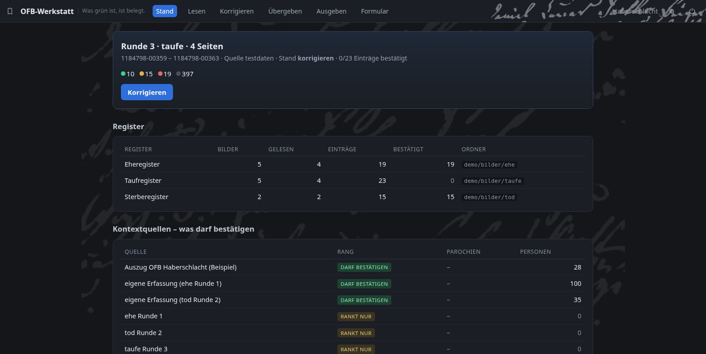
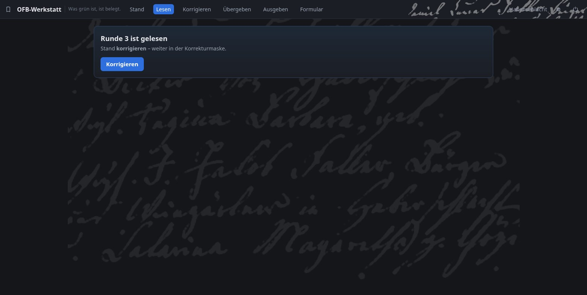
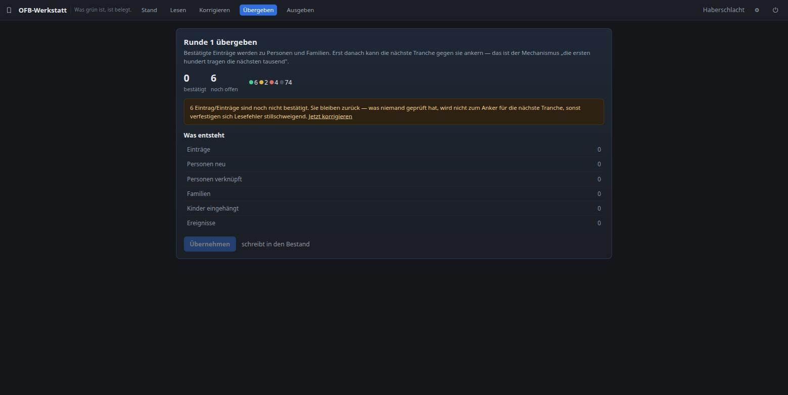
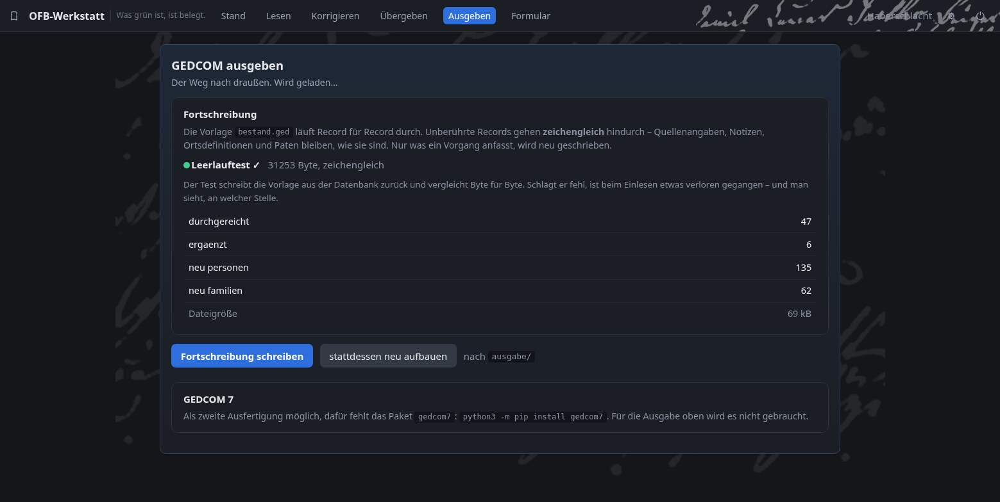
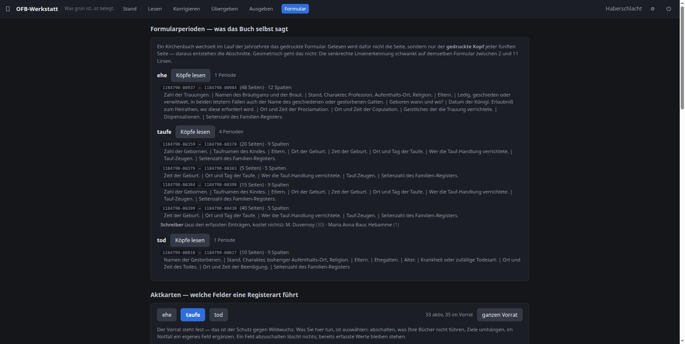
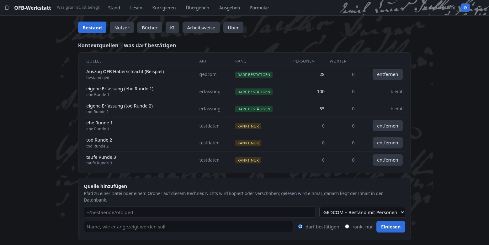
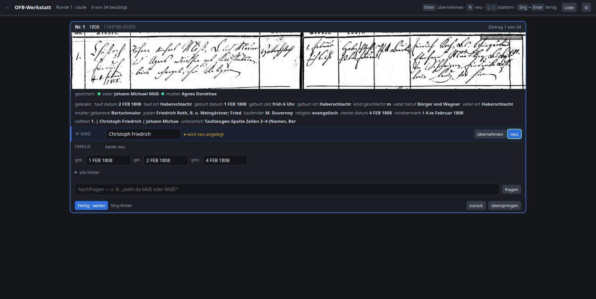
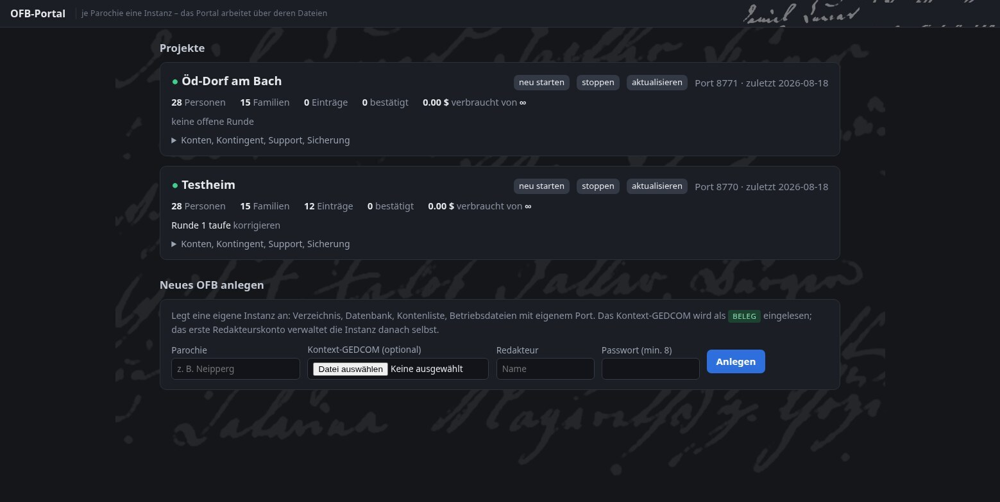

# OFB-Werkstatt

[](doku/mehrbenutzer.md)
[](LICENSE)

<picture>
 <source media="(prefers-color-scheme: dark)" srcset="doku/schrift-dunkel.png">
 
</picture>

*Eheregister Haberschlacht Bd. 6, Bild 1184798-00917, Eintrag Nr. 1
von 1808, die Elternzeile. Evangelische Kirchengemeinde Haberschlacht,
Digitalisat über Ancestry; gemeinfrei (§ 68 UrhG), Herkunft in
[`demo/QUELLE.md`](demo/QUELLE.md).*

Werkzeug für ein **Ortsfamilienbuch**: Kirchenbuchseite von einem
Sprachmodell lesen lassen, gegen den vorhandenen Bestand abgleichen,
korrigieren und als GEDCOM ausgeben.

> **In Arbeit.** Entwickelt und gemessen an den Kirchenbüchern von
> Haberschlacht, Württemberg, ab 1808.

## Wofür

Ahnenblatt, Gramps und webtrees verwalten einen Bestand gut, aber das
Erweitern aus einer Quelle ist mühsam: Jeder Registereintrag stellt die
Frage, ob eine Person schon im Bestand steht oder neu angelegt werden
muss. Die Werkstatt beantwortet diese Frage vorab und legt sie nur noch
zur Bestätigung vor.

## Zwei Betriebsarten

Derselbe Code läuft als Einzelplatz und als Server für mehrere
Parochien. Allein: `python3 start.py`, kein Login, kein Docker. Im
Verein: je Parochie eine eigene Instanz mit eigener Datenbank,
betrieben von einem Wirt-Container; Konten mit den Rollen Redakteur,
Bearbeiter und Gast, Scan-Upload im Browser, KI-Kontingent je Projekt.
Instanzen legt, startet und sichert ein Admin-Portal; nach außen
bekommt jede Parochie ihre eigene Subdomain, ein Wildcard-DNS und je
eine Zeile im Reverse Proxy genügen. Alles
Serverhafte ist Opt-in über Schalter, die der Einzelplatz nie umlegt;
der Probelauf unten prüft den Einzelplatz-Klon ohne all das. Details in
[`doku/mehrbenutzer.md`](doku/mehrbenutzer.md) und
[`doku/portal.md`](doku/portal.md).

## Der Durchlauf

Gearbeitet wird in **Runden** – eine Tranche von Seiten eines Registers,
die zusammen gelesen, korrigiert und übergeben werden:

    geplant ──lesen──► korrigieren ──übergeben──► fertig

Die Reihenfolge ist **Ehen → Taufen → Tode**: Die Eltern einer Taufe von
1825 haben nach dem Ende des alten Bestands geheiratet. Werden die Ehen
zuerst erfasst und übergeben, findet der Abgleich sie wieder; sonst
versiegt dieser Anker mit jedem Jahrgang.

Der Zustand liegt in der Datenbank. Der Läufer arbeitet weiter, wenn das
Browserfenster zugeht, und nach einem Abbruch ist ablesbar, wie weit er
kam.

## Grundsätze

- **Erfasst wird, was dasteht** – eine Zeile je Registereintrag, die
  GEDCOM-Ausgabe wird daraus abgeleitet. Zuordnung und Lesung lassen sich
  getrennt korrigieren.
- **Der Ausgangsbestand bleibt unangetastet.** Jede Ergänzung ist ein
  festgehaltener Vorgang mit Beleg; Rücknahme heißt, den Vorgang zu
  deaktivieren.
- **Grün wird nur, was ein Beleg bestätigt** – etwa `Elternehe F1149,
  oo 14.02.1798`. Die Selbsteinschätzung des Modells und die Häufigkeit
  eines Namens zählen nicht; ein Name, der hundertmal vorkommt, kann
  trotzdem der falsche sein.
- **Ohne vorhandenes GEDCOM** gleicht die Werkstatt gegen die eigenen
  früheren Einträge ab – die ersten hundert tragen die nächsten tausend.
- **Das System wird durch Benutzung besser – ohne Training.** Zwei
  Schleifen: Jede übergebene Tranche wird Bestand und ankert die
  nächste, und jede korrigierte Verwechslung geht als Fehlerkatalog
  der Schreiberhand in ihr nächstes Lesen ein. Beides sind Daten, kein
  Modelltraining; dazwischen steht die Ampel, damit sich Fehler nicht
  selbst verstärken. Die erste Schleife ist gemessen, die Wirkung der
  zweiten noch nicht.
- **Die Ausgabe ist verlustfrei**: unberührte Records gehen zeichengleich
  durch die Fortschreibung. Ein Leerlauftest belegt das bei jedem Export.
- **GEDCOM 7 als zweiter Ausgang.** Die Fortschreibung bleibt 5.5.1, weil
  die Bestände es sind und nur so zeichengleich durchgereicht werden kann.
  Daneben steht eine Neuausgabe in GEDCOM 7, geschrieben und geprüft über
  [`python-gedcom7`](https://github.com/DavidMStraub/python-gedcom7) von
  David Straub. Dort werden die eigenen Tags des Ortsfamilienbuchs
  (`_KB_NAME`, `_BERUF_KB` …) im Kopf der Datei erklärt statt geduldet.

Wie gut die Maschine liest, hängt an Handschrift, Erhaltung und Scan –
eine allgemeine Trefferquote wäre irreführend. Der Beitrag der Werkstatt
ist der Schritt danach: die Entscheidung, welche der genannten Personen
im Bestand schon stehen, samt Beleg.

## Für welche Bücher

Der Lese-Teil setzt tabellarisch geführte Register voraus:

| Bedingung | warum |
|---|---|
| Formular mit festen, gedruckten Spalten | sonst kein Spaltenraster und kein gezielter Bildausschnitt |
| ein Eintrag = ein abgrenzbarer Block | sonst fehlt die Zerlegung der Seite |
| lesbare Datums- und Nummernspalte | die Chronologie prüft, ohne den Bestand zu brauchen |
| Scan gibt Datum, Vornamen, Beruf her | auf diesen Feldern ruht der Abgleich |

In Württemberg gilt das ab **1808** (Generalreskript vom 15. November
1807: feste Spalten, Familienregister). Ältere Fließtext-Register liest
die Werkstatt nicht; als vorhandene Transkription kommen sie in den
Bestand und werden beim Abgleich trotzdem gefunden.

## Stand

| | |
|---|---|
| ✅ | Datenbasis in SQLite, GEDCOM-Import verlustfrei, Round-Trip zeichengleich |
| ✅ | Äquivalenzklassen für Namensvarianten, samt Erkennung falscher Kanten |
| ✅ | Korrekturmaske im Browser: Bildstreifen, Autovervollständigung, Familienanbindung |
| ✅ | Rundenautomat mit Hintergrundläufer, Fehler je Seite statt je Lauf |
| ✅ | Abgleich mit Ampel und Herkunftsrang (was darf bestätigen, was nur ranken) |
| ✅ | GEDCOM-Ausgabe: Fortschreibung und Neuausgabe, Import in Gramps und Ahnenblatt getestet |
| ✅ | GEDCOM 7 als zweiter Ausgang, gegen Grammatik, Verweise und Schema geprüft |
| ✅ | Vorführinstanz: derselbe Code läuft als Docker-Container hinter einem Reverse Proxy |
| ✅ | Mehrbenutzer je Instanz: Konten und Rollen (Redakteur/Bearbeiter), parallele Runden je Register, Nutzerverwaltung im Browser - ohne Kontendatei weiterhin der Einzelplatz ohne Anmeldung |
| ✅ | Admin-Portal mit Wirt: ein Container betreibt alle Instanzen; Projekte anlegen, starten, sichern, Support-Zugang, Konten und KI-Kontingent je Projekt - `doku/portal.md` |
| ✅ | Gastrolle mit Hinweis-Stift (lesen und anmerken, der Redakteur hakt ab) und Scan-Upload im Browser - die Instanz ist ohne Shell bedienbar |
| ✅ | Bedienschleife: ein Eintrag zur Zeit, Blättern und Bestätigen per Tastatur; Aufwand je Eintrag wird mitgezählt |
| ✅ | Kaskaden für Ehe und Tod: Geburtsdatum der Brautleute, Alter und Ehegatten-Umweg führen zur Taufe im Bestand |
| ⬜ | Batch-API, Bildausschnitt je Feld |

## Einblick

Die Stand-Seite mit der Ampel:



Das Lesen läuft rundenweise; beantwortete Seiten werden eingelesen,
offene warten:



Übergeben macht aus bestätigten Einträgen Personen und Familien:



Die GEDCOM-Ausgabe mit dem Leerlauftest:



Die Seite Formular: aus den gedruckten Spaltenköpfen entstehen die
Formularperioden, darunter die Aktkarte mit den Feldern der Registerart:



Die Kontextquellen mit ihrem Rang in den Einstellungen:



Die Korrekturmaske: oben der gedruckte Spaltenkopf, darunter die Zeile
des Originals über beide Buchseiten, dann die Felder. *Ganze Seite* zeigt
die Buchöffnung mit markierter Zeile, *nochmal lesen* stellt zwei
Lesungen derselben Zeile gegenüber, und im Gesprächsfenster unter dem
Eintrag lässt sich nachfragen („steht da Möß oder Wöß?") – das Modell
antwortet mit Eintrag, Bildausschnitt und Bestandstreffern vor Augen
und ändert nichts. Der Leseprompt selbst wächst mit der Arbeit: Die
beim Korrigieren gemessenen Verwechslungen einer Schreiberhand gehen
als Fehlerkatalog in ihr nächstes Lesen ein.



Das Portal des Serverbetriebs: je Parochie eine Instanz mit eigener
Datenbank und Subdomain – anlegen, starten, aktualisieren und sichern
als Knopf, dazu Konten, Support-Zugang und KI-Kontingent:



*Bildstreifen: Evangelische Kirchengemeinde Haberschlacht, Taufregister
Bd. 4, Bild 1184798-00359, Eintrag Nr. 1 von 1808. Digitalisat über
Ancestry.*

## KI und Daten

Beim Lesen gehen die Kirchenbuchbilder an die Anthropic-API. Ob die
Nutzungsbedingungen von Archion, Ancestry oder einem Archiv das decken,
muss jeder für seine Quellen selbst klären. Zum Training verwendet
Anthropic sie laut eigener Zusage bei den kommerziellen Produkten nicht;
wie lange sie gespeichert bleiben, ist Sache des Vertrags.

Alles Übrige bleibt lokal: Bestand, Erfassung und Ausgabe liegen in einer
SQLite-Datei und im Ordner `ausgabe/`, der Server hört nur auf
`127.0.0.1`. Bestandspflege und GEDCOM-Ausgabe brauchen kein Modell, die
Testquelle auch nicht.

Das Lesen hängt an einer einzigen Funktion (Bilder und Anweisung als JSON
an einen Endpunkt). Ein lokales Modell über Ollama, llama.cpp oder vLLM
lässt sich dort einhängen; ob es Kurrent brauchbar liest, kann man mit
den beiliegenden Seiten und dem Knopf *nochmal lesen* in einer Stunde
messen. Liest es schlechter, verschiebt sich die Arbeit zur Korrektur –
dafür ist die Maske da.

## Ausprobieren

Zwölf Beispielseiten liegen bei (Tauf-, Ehe- und Sterberegister
Haberschlacht ab 1808) und 69 Rohlesungen, wie das Modell sie geliefert
hat. Damit läuft der ganze Durchlauf ohne eigene Bücher und ohne
API-Schlüssel: einrichten, unter **Lesen** die Quelle *Testdaten*
wählen, korrigieren, übergeben, GEDCOM ausgeben.

Dazu ein kleiner Bestandsauszug (`demo/bestand.ged`, 28 Personen, 15
Familien): Mit ihm werden auf denselben Seiten **21 Felder grün** –
über Elternehen, taggenaue Geburtsdaten und den Ehegatten-Umweg; der
Beleg steht jeweils daneben. Ohne
ihn bleibt alles gelb; auch das ist ein gültiger Start, nur langsamer.
Die von Hand geprüften Personenverweise liegen nicht bei – der Abgleich
soll sie selbst wiederfinden.

Die Zahlen sind mit einem Befehl nachprüfbar:

```
python3 -m werkstatt.probelauf
```

Er baut aus `git ls-files` einen Klon in ein Wegwerfverzeichnis, fährt
dort den ganzen Durchlauf über die Web-Schnittstelle und vergleicht die
Ergebnisse mit dieser Seite (57 Einträge, 21 grün, Fortschreibung
zeichengleich, 0 tote Zeiger).

### Starten

Läuft unter Linux und Windows (getestet), macOS ist geschrieben, aber
ungetestet. Gebraucht wird Python ab 3.11; Pillow und numpy holt das
Startskript beim ersten Lauf selbst, und fehlt Python unter Windows
ganz, bietet die Startdatei die Installation an (über winget, Quelle
python.org). Schritt für Schritt: `doku/windows-test.md`.

| | |
|---|---|
| Windows | `OFB-Werkstatt starten (Windows).bat` doppelklicken; Ersteinrichtung: `doku/windows-test.md` |
| Linux / macOS | `OFB-Werkstatt starten (Linux+Mac).command`, oder im Terminal `python3 start.py` |

Beides endet auf `http://127.0.0.1:8765` im Browser.

## Mehrbenutzer *(neu, August 2026)*

Für eine Parochie-Instanz mit mehreren Bearbeitern gibt es Konten und
drei Rollen: Bearbeiter korrigieren und bestätigen, der Redakteur
übergibt, gibt aus und verwaltet die Instanz im Zahnrad, Gäste lesen
und heften Hinweise an Einträge. Je Register darf eine Runde offen
sein, drei Leute arbeiten parallel gegen denselben Bestand.
Eingeschaltet wird das über das erste Konto (Zahnrad oder
`python3 -m werkstatt.nutzer --anlegen`); ohne Konten bleibt alles der
Einzelplatz ohne Anmeldung. Details in
[`doku/mehrbenutzer.md`](doku/mehrbenutzer.md); Mehrparochien-Betrieb
mit Wirt und Portal in [`doku/portal.md`](doku/portal.md) – gebaut und
geprüft, aber noch ohne lange Betriebserfahrung.

## Einrichten

Alles Ortsspezifische steht in `konfig.toml`; eigene Pfade gehören nach
`konfig.local.toml` (in `.gitignore`):

```toml
[register.taufe]
titel    = "Taufregister"
ordner   = "bilder/taufe"
personen = ["kind", "vater", "mutter"]

[[kontext]]
name      = "Eigenes Ortsfamilienbuch"
art       = "gedcom"
datei     = "quellen/OFB_Musterhausen.ged"
gilt      = "beleg"          # darf bestätigen → ein Treffer macht grün
parochien = ["Musterhausen"]
```

Der **Rang** einer Quelle entscheidet über die Ampel: `beleg` darf
bestätigen, `vokabular` rankt nur. Betriebswerte (Seiten je Runde,
Modell, Plausibilitätsgrenzen) stehen unter **Einstellungen** in der
Oberfläche.

## Rechtliches

Scans von Archion, Ancestry und ähnlichen Diensten dürfen nicht
weiterverbreitet werden; `bilder/` und `daten/` sind deshalb von der
Versionsverwaltung ausgenommen. Die Beispielseiten und der
Bildstreifen oben sind die begründete Ausnahme: Vorlagen von 1808/09,
gemeinfrei, nach § 68 UrhG auch als Reproduktion. Herkunft und Zitation
stehen in `demo/QUELLE.md`.

Die MIT-Lizenz gilt für den Code, nicht für Kirchenbuchdaten, Scans oder
Transkriptionen.

## Sprache

Deutsch: Code, Kommentare, Konfiguration und Oberfläche – die Register
und ihre Bearbeiter sind es auch. Anzeigetexte sollen später vom Code
getrennt werden, damit weitere Sprachen möglich sind.

## Zum Nachlesen

| | |
|---|---|
| `doku/landkarte.md` | wo liegt was, welcher Bestand gilt wofür |
| `doku/ansatz.md` | Begründung der Entwurfsentscheidungen |
| `doku/verknuepfung.md` | die Kaskade je Aktart |
| `doku/workflow.md` | der Arbeitsablauf von der ersten Seite bis zur Ausgabe |
| `doku/gedcom7-tags.md` | die eigenen Tags des Ortsfamilienbuchs, Ziel der Schema-URIs |
| `doku/mehrbenutzer.md` | Konten, Rollen, Gastrolle und Hinweis-Stift |
| `doku/portal.md` | Mehrparochien-Betrieb: Wirt, Portal, Support-Zugang, Sicherung |
| `doku/naechste-sitzung.md` | Stand und offene Punkte |

Lizenz: MIT.

---

## In English

**OFB-Werkstatt** builds a German *Ortsfamilienbuch* (local family
register) from parish registers: a model transcribes the page, you
correct it, and each named person is matched against your existing
dataset. Output is GEDCOM. The reading step presupposes tabular,
pre-printed registers (in Württemberg the rule from 1808 onward) and
sends scans to the Anthropic API – check your image licence. Runs
either as a local single-user app (one command, no accounts) or as a
multi-parish server with role-based accounts and an admin portal.
Interface and documentation are in German.
